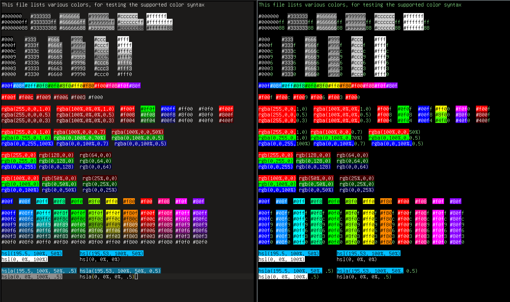

# clrzr

A Vim plugin to accurately highlight common color representations.

### Asciicast

[](https://asciinema.org/a/460355)

### Screenshots



The left screen shows `colortest.txt` when the current `:colorscheme` supplies a
hex `#RRGGBB` background color for the `Normal` highlight group.  This allows us
to blend alpha values with the current background color.

The right screen shows the same file when the background color is either supplied
as a palette index, or omitted.  In this case, we ignore the alpha term and
exclude it from the highlight, since we no longer have a precise color value
to blend with.

#### Hex Modes
	- (#|0x)RGB
	- (#|0x)RGBA
	- (#|0x)RRGGBB
	- (#|0x)RRGGBBAA

#### CSS Modes
	- rgb((byte|%), (byte|%), (byte|%))
	- rgba((byte|%), (byte|%), (byte|%), ([0,1]|%))
	- hsl([0,360], %, %)
	- hsla([0,360], %, %, ([0,1]|%))

### Installation

```sh
  cd ~/.vim/pack/plugins/start
  git clone https://github.com/BourgeoisBear/clrzr
```
Rebuild helptags with `helptags ALL`, then see `:help clrzr` for more options.

*NOTE:* `clrzr` requires a copy of `awk`, callable from your system path.
This is used to speed up pattern extraction.  Almost any version will do.
On Unix/Linux/Mac, it is probably already intstalled.

### True-Color Support

Works in gVim or any terminal with true-color support.  If your terminal is true-color, but
you are not seeing the colors, add the following lines to your `vimrc` and restart:

```vim
  " sets foreground color (ANSI, true-color mode)
  let &t_8f = "\e[38;2;%lu;%lu;%lum"

  " sets background color (ANSI, true-color mode)
  let &t_8b = "\e[48;2;%lu;%lu;%lum"

  set termguicolors
```

### Colors As You Type

```vim
   set nocursorline
```

Sometimes, `cursorline` obscures the highlights added by `clrzr`.  Disable it to see
colors as you type them.  Very useful in combination with `CTRL-A` and `CTRL-X` (increment & decrement)!

### Origin

This version is based on https://github.com/lilydjwg/colorizer, also found as
[colorizer.vim on vim.org](http://www.vim.org/scripts/script.php?script_id=3567)
